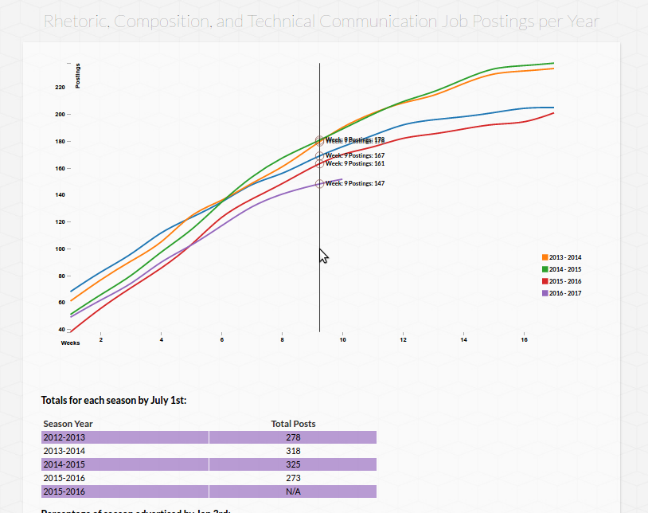

# Multi-Line Chart for Rhetoric, Composition, and Technical Communication Job Postings per Year

A repo for a dataviz of Jim Ridolfo's [rhetmap.org](http://rhetmap.org/) data.

- Spreadsheet of data: [https://docs.google.com/spreadsheets/d/1GuECV6Ot60h-Qab3e9-KPaKLdgXB3reoyZgo3VTlO_w/edit#gid=0](https://docs.google.com/spreadsheets/d/1GuECV6Ot60h-Qab3e9-KPaKLdgXB3reoyZgo3VTlO_w/edit#gid=0)
- Data Feed Source: [https://spreadsheets.google.com/feeds/list/1GuECV6Ot60h-Qab3e9-KPaKLdgXB3reoyZgo3VTlO_w/od6/public/values?alt=json](https://spreadsheets.google.com/feeds/list/1GuECV6Ot60h-Qab3e9-KPaKLdgXB3reoyZgo3VTlO_w/od6/public/values?alt=json)

## Datapoint ideas

Place to consider new datapoints and how to use them. Please feel free to suggest and add more ideas here.

### Denote certain traits of position:
- University research rank: R1-3.
  + Compare when certain univs. post ads.
- Position type: Techcomm, Rhetoric, WPA, Writing Center, Postdoc
- Teaching load: 2/2, 2/3, 3/3, etc.
- Position foci: generalist, rhetoric of science, digital rhetoric, professional writing, public policy, etc.
  + Noted how 2016-2017 seemed to include many rhetoric of science calls.
