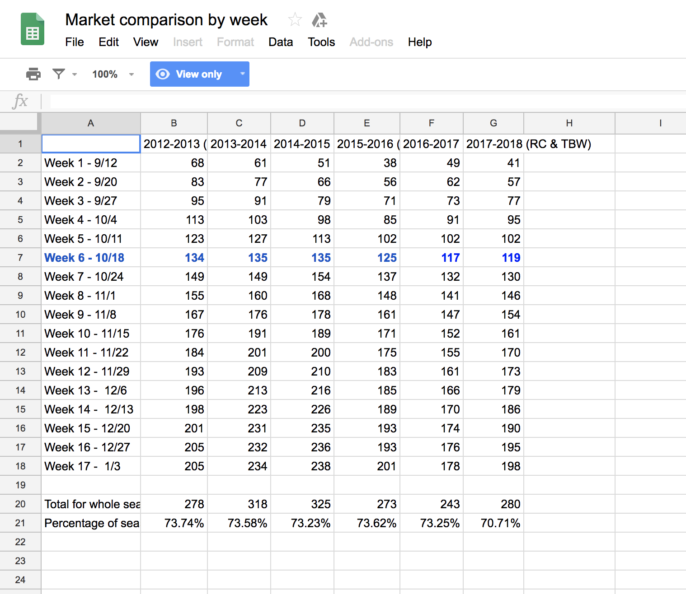
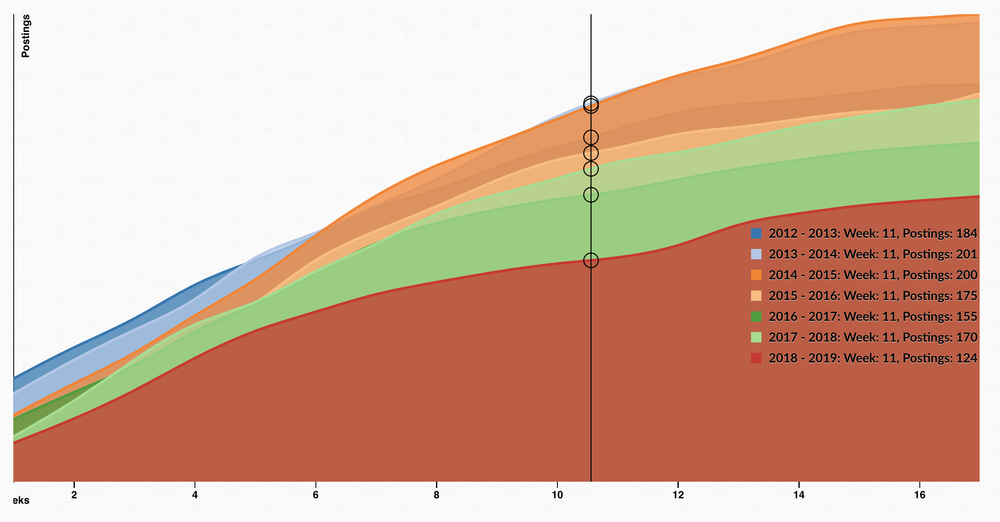
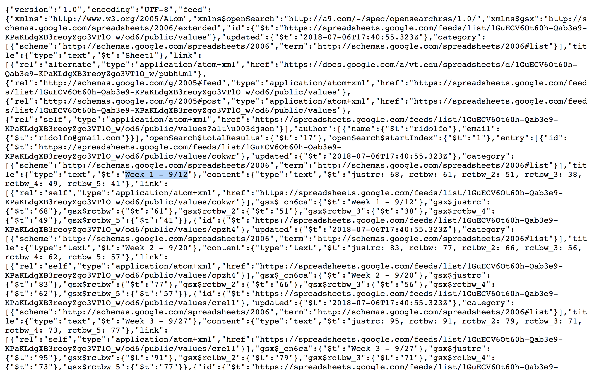

# From data feed to data viz: Reviewing the rewriting of the tabulated data

In the ordered list below, I review the major changes in the way the data was originally structured as tabulated information. Be sure to note how Ridolfo's data is written as a typical spreadsheet, which follows the standard rows and columns structure. In the second list item, note how the spreadsheet is reformatted as a JSON (JavaScript Object Notation). Then, be sure to note how I revise the data from its original format, using the JavaScript programming language. I use the first year (2012-2013) as a running example throughout the list below, as well as console logs which I review in the video:

1. In the below image, this is how Ridolfo has structured the data in a table format:   Note how the table's rows observe a *per Week* period, while the columns track the interested totals *per Year*. Now, compare these textual modes to the way they are represented in the temporal chart below. Notice how the *per Week* rows became the *x-axis* values along the bottom to chart the *per Year* values as individual lines with their weekly values along the *y-axis*.      

2. In the <code>getData()</code> function (lines 38-74), I retrieve the spreadsheet data in the JSON feed format. Note that this [JSON feed](https://spreadsheets.google.com/feeds/list/1GuECV6Ot60h-Qab3e9-KPaKLdgXB3reoyZgo3VTlO_w/od6/public/values?alt=json) includes data specific to the application data, which helps render the details of the user-interface rendering of Ridolfo's original table. Consequently, it includes far more information than I need; hence, the data processing work to follow.     

3. At the start of the <code>formatData()</code>, inside the <code>for</code> loop, I write the <code>yr1213wks</code> and other weekly data into a *per Year* array (list) structure:  <code>["68", "83", "95", "113", "123", "134", "149", "155", "167", "176", "184", "193", "196", "198", "201", "205", "205"]</code>.  Note how the array of items are in the order from the original table. Be careful about how you create any lists, since some computational methods in programming languages might rearrange values based on when and how they retrieve them.     

4. In <code>writeYears()</code>, I write the <code>yr1213</code> and other year data into what is called a *JS object array*: <code>{ yr: "2012 - 2013", wks: ["68", "83", "95", ...] }</code>. In this case, <code>yr</code> means "year" and is the key for the string value of the year, and <code>wks</code> means "weeks" and is the key for the array list of respective weekly job-posting totals.  
  <pre>
{
      yr: "2012 - 2013",
      wks: ["68", "83", "95", "113", "123", "134", ...]
}
  </pre>  Object arrays provide you the capacity to name key-value paris and also create hierarchical relationships, if necessary.   

5. In <code>writeMarketData()</code> <small>(lines 187-196)</small>, I write the <code>yrData</code> format:  <code>[ { yr:"", wks:[...] }, { yr:"", wks:[...] }, ... ]</code>.  <code>yrData</code> is an array that combines the multiple "yearly data" objects that I created prior to this moment in the code, which have the same 2 key-value pairs: <code>yr</code>, the years, and <code>wks</code>, the sorted array list of weekly totals.  
  <pre>[
      {
        yr: "2012 - 2013",
        wks: [ "68","83","95","113",... ]
      },
      {
        yr: "2013 - 2014",
        wks: [ "61","77","91","103",... ]
      }
      ...
  ]
  </pre>
